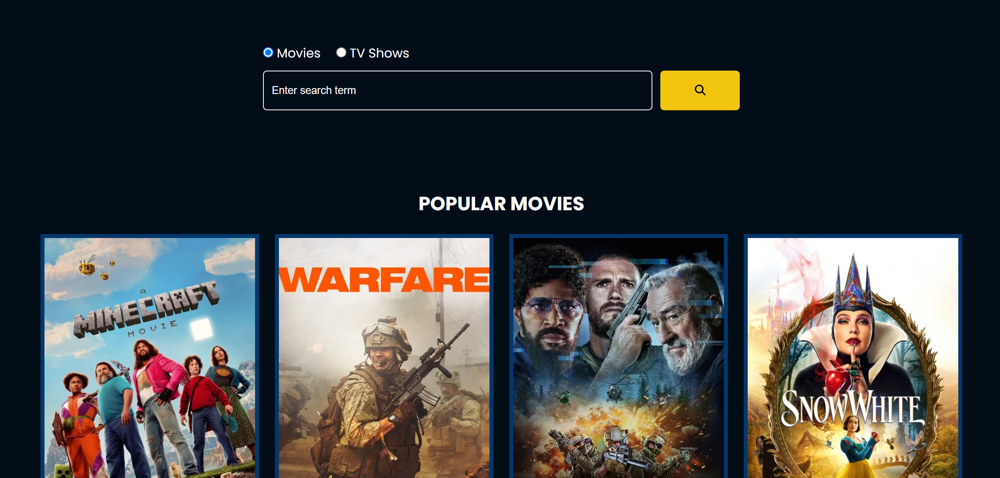

# Movie & TV Show Flixx

## Project Overview

This project lets you search for movies and TV shows, browse results with pagination, and view detailed information about each title. You can also add your favorite movies or shows to a personalized favorites page for easy access later. The app uses vanilla JavaScript to dynamically render content and handle user interactions.

## Features

- Search movies and TV shows by keyword
- Pagination to navigate through search results
- Detailed pages showing posters, ratings, release dates, genres, overview, and production info
- Add or remove items from your favorites list
- Favorites page to quickly access saved movies and shows
- Responsive UI with clear navigation

## Technologies Used

- JavaScript (Vanilla) for dynamic UI and logic
- HTML5 & CSS3 for layout and styling
- Font Awesome for icons
- TMDb API for fetching movie and TV show data

## Additional Notes

- Favorites are stored locally (e.g., in localStorage) to keep your selections persistent between sessions.
- The project structure is modular and easy to extend with new features like user authentication or watchlists.
- Designed for simplicity and smooth user experience without heavy frameworks.

## License

MIT
